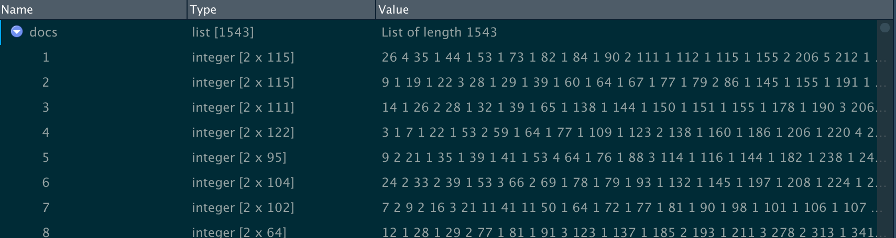
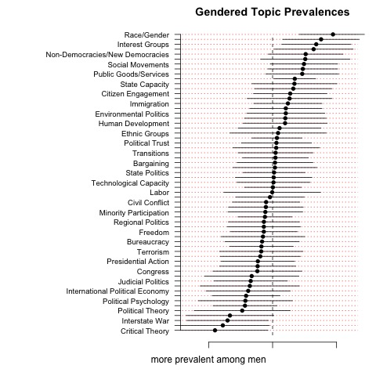

___
## Number of words is `r wordcountaddin::word_count("source/Repl_ResearchLikeGirl.Rmd")`
___

Section 1 - Introduction  
Section 2 - Replication implementation   
Section 3 - Individual features   
Conclusion  

___


## Section 1 Introduction

I've added code and text to the chunks because of MacOS, RMarkdown and to avoid long runtimes. Initialized R Markdown document with global defaults  

```{r setup, include = TRUE}
#USE eval = FALSE for just knitting

knitr::opts_chunk$set(warning = FALSE, eval = TRUE)
```


__*Line 1 of original "yrlag-clean.R"*__  

Inserted "here" function for building paths, package installed once and loading the library. Replication libraries are set in chunk *load Packages*. 

```{r here, eval = TRUE}
#setwd("C:/Users/Jane Sumner/Dropbox/Gendered Research Agendas")

#commented Line 1 and replaced the hard path with here()
#install.packages("here") 
library(here)
```

___

### Summary

The authors explored the hypothesis that women’s political careers are slower to advance because they do not publish as much as men. By studying published dissertations, the authors identified that some research topics seem to be favoured by each gender and thus are also published with more frequency by top journals. While research has not found evidence of systematic bias on political research journals, the authors do find evidence of topic bias, despite it being proportional to dissertation's research bias. 
__Their conclusion:__ “We found that there are topics systematically associated with women and fewer systematically associated with men.“  

___

### Structural Topic Model (stm)    


__stm__ allows topics to be generated by the data rather than be defined beforehand, producing two quantities of interest:  
  __a.__ associations between those topics and author characteristics.      
  __b.__ a group of topics identified by groupings of words 


The authors “used structural topic model (STM) (Roberts, Stewart, and Tingley 2014) and created a new and comprehensive dataset of dissertation abstracts.”(Key, 2019). I perused the STM Vignette, the CRAN documentation and a topic modeling video [Topic modeling of Sherlock Holmes stories](https://juliasilge.com/blog/sherlock-holmes-stm/) from Julia Silge (RStudio Data scientist).  

As a source, they collected a new dataset from the ProQuest Central database.  

As scope and to avoid confounders such as “the biases associated with publication and section memberships” (Key, 2019), the authors decided on the selection of English language dissertations from the years from 2000 to 2013, which listed as its first subject “political science,” “politics,” or “government”.   


___

### Replication preparation

I opened GitHub project ["RepLikeGirl"](https://github.com/mona-a/RepLikeGirl/blob/master/Source/Repl_ResearchLikeGirl.html), where tidy structures and ["Good Enough Practices"]( http://swcarpentry.github.io/good-enough-practices-in-scientific-computing/.) are taken into account. 

I set up the Markdown directory to knit under my directory *source*, since here is where I am saving the R files. 

Most chunks have given running warnings or errors, besides the missing files and variables; in general I have followed this process to solve issues:

* Develop code in chunks and execute the chunks until they work, then move on.
* knit the document regularly to check for errors. When I have an error:
    1. pay attention to the paths and home directories
    2. review the synthax
    3. split the code to its minimal elements and run individual  
        *sometimes you need to run all the code together, so give this a try*   
    4. test run the code in the console   
        + restart R  
        + do 1 to 3, then run all the related chunks   
        + google for an answer  
        + restart at 1 till problem is solved or I've spent aproximately 45 min.  
        + go to sleep  or at least make a time out, do it all once again  
        + tag Andrea for help in GitHub 
   
___

## Section 2 - Replication implementation   

For the replication script, R advised to install packages. I had accepted compiling from CRAN sources, but had an error with RcppArmadillo because I do not have any compiler tools installed.  For MacOS the R Support recommendation is to take only compiled binaries as delivered from CRAN.    
I'm commenting the code on the chunk so it is not running every time I knit.

___
__*Line 3*__   
Surprisingly, I found no evidence that the tidyverse was loaded. When I added it during an interation, it returned overwriting problems for functions so i avoided it further.

```{r loadPackages}
#install.packages(c("SnowballC", "stm", "tm"))
library(stringr)  
library(stm)  
library(SnowballC) 

library(tm)

# install.packages(c("Rtsne", "rsvd", "geometry", "remotes"))
# remotes::install_github("benmarwick/wordcountaddin")
# message: also installing the dependencies ‘abind’, ‘magic’, ‘lpSolve’, ‘linprog’, ‘RcppProgress’
library(Rtsne)
library(rsvd)
library(geometry)

```

___
__*Line 7*__   

Reading the data was problematic, so I decided split code from the original line until the path problem is solved. I restarted Rstudio.

```{r check, echo = FALSE, eval = FALSE}
#diss_test <- read.csv(here("data", "dissertation-data-clean.csv"))
#rm(diss_test)
```

___
__*Line 8*__ 

I noted that the *here()* function must be closed before stringsAsFactors.

```{r dataset, eval=TRUE}
diss <- read.csv(here("data", "dissertation-data-clean.csv"), stringsAsFactors=F)
```


```{r random, echo = FALSE, eval = FALSE}
# My randon reminders:
ncol(diss)
dim(diss)
s <- summary(diss)
diss_structure <- names(diss)
diss_head <- head(diss)
```

___
__*Line 10*__  

This histogram was not printed in the research paper, but it's included in the replication data. Changed 
col="gray" to "light blue"
breaks=seq, kept number of bars  since calendar years prints until 2014 which is congfusing

```{r perYear, eval = TRUE, fig.width = 8, fig.height = 6}
# Not exactly Figure A1, because the replication data is subset to only the data we used in the analysis,
# but it conveys similar information.
hist(diss$year,main="Dissertations Filed with Proquest\nby Year",col="light blue",
     breaks=seq(1999.5,2013.5,1),xlab="year")
```
     
This correction to calendar year shows that original histogram is better:
```{r Fig2, eval = TRUE, fig.align = "center", fig.width = 4, fig.height = 3}
# MP made histogram smaller, then changed to both "FD" and 13 bars, one bar for each year but the  
# largest change is observable, only on first year so I understand why the kept it from half 
# year to the next
hist(diss$year,main="Dissertations Filed with Proquest\nby Year",col="light green",
     breaks=13,xlab="year")
```  

___     
__*Line 15*__

Accompanying data was clean with pre-calculated probabilities of gender estimation. Because of the data contents, the possibility of finding NA is high. Dichotomous tabulation of data due to the possibility of genderless names (e.g. Shu), using variable gender and its frequency. 

Cross tabulated for gender confirmation between high and low probabilities of the author being a woman:

```{r authorGender, echo = TRUE}
# Dichotomous coding of author gender, both loose (Pr(woman)>.5 => "woman") and  "woman",
# strict (Pr(woman)>=.7 => Pr(woman)<=.3 => "man").
table(diss$woman.loose,useNA="always")
round(table(diss$woman.loose,useNA="always")/sum(table(diss$woman.loose,
      useNA="always")),3)
```
   
Strict or above average probability of the author being female:
```{r probFemale, echo = TRUE}
table(diss$woman.strict,useNA="always")
round(table(diss$woman.strict,useNA="always")/sum(table(diss$woman.strict,
                                                       useNA="always")),3)
```


The original sample size was of 2,055 dissertations, with a final sample size of 1543 after controls were executed to omit schools with less than three dissertations (confounder) and two dissertations with no abstracts.

Both calculations returned the same amount of assumed male authored dissertations at 913 or 59% and female authored dissertations at 630 or 40.8%.  However, the results presented on the paper were for 2055 entries and do not match with the results of this code. 

Since the Research design explanation (p. 664) clarifies that they 

  * identified 659 dissertations (36.4%) as woman-authored  
  * identified 973 dissertations as man-authored (53.8%)  
  * omitted 176 entries (9.7%) where they couldn't identify the gender  
   
```{r differences, echo TRUE}
#proportional difference between published paper and replication results with final dataset.
#use results from above in an object to recalculate the 10% diff?

sum(table(diss$woman.strict,useNA="always"))
659+973+176
# this addition is 1808, less 176 is still higher than the 1543. percentages are ok though. #what to do?
x = 36.4+53.8+9.7 
x
```


The final value of all threee distributed dissertations is 99.9%. Having compared the difference in both results, __I concluded that the 10% difference between original and controlled samples is not significant.__
   
   
___
__*Line 25*__

Unpublished plot to visually verify gender assumptions. The 30% difference should be highlighted.  

```{r barplotGender, eval = TRUE, fig.width = 9, fig.height = 6}
# Figure A2 in Supplementary Online Appendices 
barplot(t(table(diss$year,diss$woman.strict)), col = c("lightblue", "mistyrose",
                "lightcyan", "lavender"), legend.text=c("Man","Woman"),
        main="Dissertations Filed With Proquest Per Year\nand Gender",ylim=c(0,250),
        border = "dark blue")
```
 
___
__*Line 30*__  

The purpose of a structural model is to find the most recurrent words and its pairings in a text, named *topic prevalence*. Each dissertation is one row in the csv file and there are numerous covariates, hence I incorrectly assumed this is a quanteda dfm object (document-feature  matrix). However, stm documentation clarified that when a "document is a sparse matrix or quanteda dfm object, then vocab should not *(and must not)* be supplied" because it "is contained already inside the column names of the matrix"(CRAN docu, p59).


__Step 1__ To prepare for STM,  text must be transformed to fit the function's format. They used the stm unction textProcessor, which is  essentially a wrapper *tm package*, hence, after error I added it to  chunk *load Packages*.  

Because language defaults to English, I assume it will use the default available stopwords. If I run this for other countries, must include new/own array with parameter *customstopwords*.

Here the authors only used the contents of the variable "Abstract" and assigned the dataframe *diss* to construct the metadata source.

```{r prepText}
# 1. Setting up the STM
tx <- textProcessor(diss$Abstract,meta=diss)
```

I tried to knit here but it tells me it cannot find the function, though I can see *tx* in the environment. I executed the next line (2) without trouble.
   
   
__Step 2__ As per stm recomendation (p. 69, *Details*), prepDocuments was  used to further
prune infrequent words with a minimum treshold of 15 repetitions to be considered. By looking at the contents of documents (the data obtained from variable *"Abstracts"*), values in the vocabulary and metadata, per word, the function also renumbers word indices (to correct for zero-indexing.

```{r prepDocs}
# 2. Setting up the STM
out <- prepDocuments(tx$documents, tx$vocab, tx$meta, lower.thresh=15)
```


"The stm package represents a text corpus in three parts: a documents list containing word indices (Step3) and their associated counts, a vocab (Step4) or character vector containing the words associated with the word indices, and a metadata matrix containing document covariates(Step5)."  [CRAN](https://cran.r-project.org/web/packages/stm/stm.pdf)
   
   
__Step 3__ Assigned the lists of the 1543 dissertations combination of words to object docs. 
“Each document is represented as an integer matrix with two rows, and columns equal  to  the  number  of  unique  vocabulary  words  in  the  document.   The  first row contains the 1-indexed vocabulary entry and the second row contains the number of times that term appears” (CRAN p59). 

```{r feedIndices}
# 3. Setting up the STM
docs <- out$documents
```

View of *docs* matrix:    
   
   
__Step4__ Assigned the words of the created vocabulary to a characer vector

```{r vocab}
# 4. Setting up the STM
vocab <- out$vocab

# Mona wants to see 
head(vocab)
```
   
   
__Step5__ created data element with the selected document metadata, that is, very much the original file *"dissertation-data-clean.csv"*

```{r metadata}
# 5. Setting up the STM
meta <-out$meta
```

*NOTE* Steps 1 thru 5 run all at once but not chunk by chunk, when it gives an error message. I think is because I was knitting each chunk and the environment changed.
   
___

### The actual STM building

__*Line 38 *__   

The number of topics most likely to exist in the data. STM identified 61 topics, more than the APSA sections.  

I did start this run and an error in traceback requested to add *Rtsne,rsvd* and *geometry packages* in the chunk *load packages*.  

I then ran this chunk for 90 min to see how long is "forever", which is about 5 days (4 minutes per 4 iterations, for the 61 topics. __I cancelled the process.__ 

```{r stmTopics, eval = FALSE}
# # This part is how we determined the number of topics. I suggest not running it unless you're
# # quite curious, as it takes forever.
# #  It'll also yield a slightly different number every time, just by the nature of simulation.
K.store <- NULL
for(i in 1:100){
K <- 0 #0
fit <- stm(out$documents, out$vocab, K =K,
                   prevalence =~ woman.strict+as.factor(School)+s(year), max.em.its = 5,                     data = meta, init.type = "Spectral")
K.store <- c(K.store,nrow(labelTopics(fit)$frex))

}
par(mar=c(4.1,4.1,4.1,1.1),mgp=c(2.1,.5,.5))

hist(K.store,main="Discovered Topics",col="gray",xlab="number of topics",breaks=seq(min(K.store)-.5,max(K.store)+.5,1))

```

   
___
__*Line 53*__  
Created an object which estimated the amount of abstracts published by women (in this case woman.loose and woman.strict resulted in the same number) if the school had more than three publications. Converged at 14 minutes. This part gives problem for knitting as the object "fit" is often not found despite being in the environment.   
*I have added cache = TRUE to try and overcome this, but I set eval to FALSE so I can knit.*

```{r KwithControls, echo = FALSE, eval = FALSE, cache = TRUE}
# Step 1: Estimate topics and prevalence from abstracts as a function of binary gender, 
# controlling for school and year
K <- 61
fit <- stm(out$documents, out$vocab, K = K,
           prevalence =~ woman.strict+as.factor(School)+s(year), max.em.its = 100,
           data = meta, init.type = "Spectral")
```

   
___
__*Line 59*__  

This didn't run because the file was not provided. So I created file *Rep_frex-8-24.csv* out of the 
csv file *output-for-figure* (from the Harvard Dataverse) which is meant to provide for the Figure 1 plot, but  also supplied the necessary information since *shorttopic* contains the same information that the required *label* entry in the code (I made this inference following the logic of the paper's research design and the next lines of code). 

Manually re-created the file in csv by extracting the first two columns from *output-for-figure.csv* 
and renaming it to *Rep_frex-8-24.csv*   

```{r checkMissingFile, eval = FALSE}
#Monica inserted code to make sure that stm object "fit" contains the same topics as 
#file output-for-figure.csv: Yes.
summary(fit)
summary(head(fit))
fit_frex <- summary(fit)$frex
```

   
___
__*Line 59 coninued*__ 

Dr. Sumner later provided the file, and despite differences in the number of variables, my theory provided right for replication purposes. 

```{r lTopics}
# These are the labels we assigned to the topics on the basis of the frex (Frequent-Exclusive) words from the model.
# The topics themselves are just our shorthand, and people can interpret the topics any way they'd like (within reason).
# labeled.topics <- read.csv("frex-8-24.csv",stringsAsFactors=F)
labeled.topics <- read.csv(here("data", "Rep_frex-8-24.csv"), stringsAsFactors=F)
labeled.topics <- labeled.topics$label

# MP my file (2 columns) and theirs (8 columns) differ in structure, it will create a different sort
#MPlabeled.topics <- read.csv(here("data", "Rep_frex-8-24.csv"), stringsAsFactors=F)
#MPlabeled.topics <- MPlabeled.topics$label
```

   
___
__*Line 64*__  
This chunk estimates the exclusivity of using a recurrent word from the vocabulary per topic. I didn't
understand what "line the order" meant, but the *summary(fit)* line would not run with either my file or their file. This is probably why the topics in my graph are in a different order even if the curve is similar.


```{r frex, cache = TRUE}
# # If you rerun the model, check to make sure the order still lines up -- it should, but if it doesn't, need to reorder
#summary(fit)$frex==labeled.topics[,2:8]s

frex <- apply(summary(fit)$frex,1,paste0,collapse=",")

```

   
___
__*Line 70*__   

This code is not working because *subfields* is not defined in this file, according to the paper I infer that subfields are equal to the number (i.e. 61) of topics: *"Women are not equally distributed across the subfields."* (Key,E. 2019, page 664).

However, using any value between 0-61 returns error   
  *"using formula(x) is deprecated when x is a character vector of length 1"*   
I didn't find anything in Stackoverflow or elsewhere, only by reviewing the CRAN documentation I understood how to circunvent this problem:   
  *formula*  "A formula for the regression. It should have an integer or vector of numbers on the left-hand side and an equation with covariates on the right hand side. Details... left hand side ...uses a vector ...If left blank then the default of all topics is used".(CRAN) 

__Hence I left it blank since any integer returned is a deprecated parameter.__

This chunk created linear regressions with *topic prevalence* as dependent variable (outcome), and *gender*, *time* and *school* as independent variables. 

```{r regressions}
# Runs a series of linear regressions.
#  prep <- estimateEffect(1:length(subfields) ~ woman.strict+as.factor(School)+s(year), fit,
prep <- estimateEffect(  ~ woman.strict+as.factor(School)+s(year), fit,
                       meta = out$meta, uncertainty = "Global")
```
   
   
___
__*Line 74*__   

This chunk created the coefficients for each topic, however, despite the author's comments, it collected the regressions for both genders, not only women.
   
```{r extract Regression}
# Extracts the regression tables.
tabs <- summary(prep)$tables

# Extracts the coefficient for "woman" from each regression table.
sig <- data.frame()
for(i in 1:length(summary(prep)$tables)){
    sig <- rbind(sig,data.frame(topic=frex[i],shorttopic=labeled.topics[i],t(tabs[[i]][2,])))

    }

names(sig) <- c("topic","shorttopic","coefficient","stderr","t","p")
sig <- sig[order(sig$coefficient),]
```

   
___
__*Line 90*__    

Aligned the data according to the author's gender, irrelevant for next Figure 1.

```{r wo-men, eval = FALSE}
# Indicates whether the coefficient is positive and significant or negative and significant
# (A relic of when we were basing the color on the significance for ease of viewing.)
sig$positive <- ifelse(sig$coefficient>0 & sig$p<=.05,1,0)
sig$negative <- ifelse(sig$coefficient<0 & sig$p<=.05,1,0)
```


___
__*Line 94*__   

Original plot for Figure 1. The solid lines are 95% confidence intervals. This plot will show a similar curve in the coefficients between female and male, but the order of the topics differs in at least 3 positions, making me wonder if there's a problem with the coefficient calculation.


```{r Figure1, echo = TRUE, fig.show = "hold", fig.height = 18, fig.width = 12}
#1. Open jpeg file
#jpeg(here("output", "newFigure1.jpg"))
# Plot
par(mar=c(3,16,2,1))
plot(sig$coefficient,c(1:length(sig$coefficient)),yaxt="n",pch=16,xlab="more likely among men                           more likely among women",ylab="",
     main="Gendered Topic Prevalences",xlim=c(-.02,.02),bty="n",xaxt="n",col=col,type="n")
segments(y0=c(1:K),x0=-.03,x1=.02,lty=3,col="red")
points(sig$coefficient,c(1:length(sig$coefficient)),pch=16)
axis(1,at=c(-0.015,0,0.015),c("more prevalent among men","equal","more prevalent among women"))
segments(x0=sig$coefficient-1.96*sig$stderr,x1=sig$coefficient+1.96*sig$stderr,
         y0=c(1:length(sig$coefficient)))
segments(y0=0,y1=length(sig$coefficient),x0=0,lty=2)
axis(2,at=c(1:length(sig$coefficient)),sig$shorttopic,las=2,cex.axis=.8)
#dev.off()
# end of Research file
```
   
Figure 1 re-calculated  
   
   
     

          
___   

###This section contains 494 words

## Section 3 - Individual features


I struggled with the naming convention for chunks, with knitting and with adapting syntax in chunks YAML, wordcount, loadPackages, dataset, Kwithcontrols, checkMissingFiles. 

__Chunk setup:__ manipulated local and global options with knit to include source code as needed in the Markdown file with *echo*, avoid printing my own tests, *cache* large data runs and instead of commenting, avoid repetitive evaluations of chunks with *eval*, figures’ sizes.

__Chunk here:__ facilitated paths 

__Chunk perYear:__ changed the colours on “histogram per Year” from *grey* to *blue*. Verified choice of the half year columns as they were more representative than calendar years.

__Chunk barplotGender:__ Changed colours on barplot to indicate both gender and total (*border* dark blue)

__Chunk differences:__ the calculation samples for the dissertation probability table based by gender __were different in the paper and in the code. I had to review it to confirm that the variance was minimal .01%.__

__Chunks prepText to metadata:__  stm Steps1 to Step5 gave an error unless all chunks knitted together.

__Chunk checkMissingFile:__ inserted code to make sure that *fi*t contains the same topics as file *output-for-figure.csv*: _Yes it does__ because the regressions ran and because I got the original file after the fact to compare.

__Chunk regressions:__ missing variable in the code, had to adjust the formula by using total number of topics.

__Chunk Figure1:__ Saved file to disk, while graph is correct, not all 61 topics are displayed

__Separate File *”Repl_plot-file.Rmd*:__ Revised and compiled extra file and dataset for the main plot to be run *output-for-figure.csv*. I didn't need to calculate the regressions anew, as the coefficients were already included in the data file. __The output is replicable and equal to the published figure.__

__Chunk wordcount:__ added wordcountaddin() as specified in Syllabus.
   
   
___
   
# Conclusion
   
The code must be understood and executed in combination with the paper as one of the main variables (hand coded labels) was excluded from the data. Overall, I do not believe the authors believed this has a negative connotation since all variables may at one point be considered confounders.

The application of stm conforms to theory, but by the nature of the data and the model, replication requires setting and providing a seed argument for the random number generator, which was not done. __Hence, the code is reproducible but not replicable, except for the plot Figure 1 *”Repl_plot-file.Rmd*  which, as mentioned above, was successfully replicated with identical results as in the paper.__ 

For a Seminar paper (replication work) on this model I would definitely  

  * add a seed   
  * pursue the use of matched sections from a respected source (e.g. APSA) as was the original intention of the authors   
  * change some of the plots with ggplot for stm   
  * execute with Swiss dissertations   
  * try to avoid manual verification of the gender by name or improve the manual method   
  * tidy code   
  * insert more elegant features (e.g. ToC).   

### End of Replication and RMarkdown file.