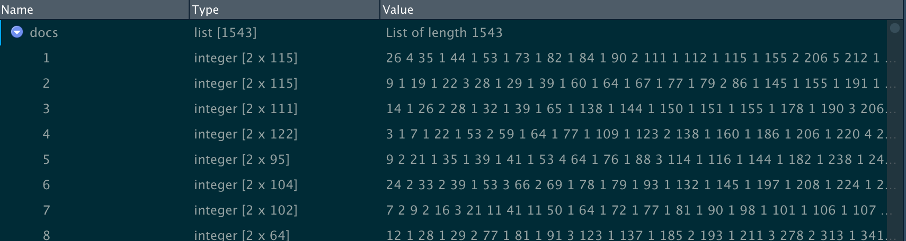

Knitr will treat each option passed on to knitr::opts_chunk$set as a global default 
that can be overwritten in individual chunk headers, as this is a replication, it is 
set to TRUE. However, I do not want my tests printed.

```{r setup, include=FALSE}
knitr::opts_chunk$set(echo = TRUE, eval = FALSE)
#use eval = FALSE for just knitting
```

__*Code Line 1*__  

By looking at the first line of code, I realized I needed the "here" function to building paths to my project files, so installing that package and loading the library in the console were the next thing to do 

```{r here, eval = TRUE}
#setwd("C:/Users/Jane Sumner/Dropbox/Gendered Research Agendas")

#commented Line 1 and replaced the hard path with here()
#install.packages("here") 
library(here)
#here::here("data")
```

```{r word count, eval = TRUE}
#install.packages(c("here", "remotes"))
#remotes::install_github("benmarwick/wordcountaddin")

#wordcountaddin::word_count("source/Repl_plot-file.Rmd")
wordcountaddin::word_count((here("source", "Repl_ResearchLikeGirl.Rmd")))
```


## Introduction

The authors explored the hypothesis that women’s political careers are slower to advance because they do not publish as much as men. By studying published dissertations, the authors identified that some research topics seem to be favoured by each gender and thus are also published with more frequency by top journals. While research has not found evidence of systematic bias on political research journals, the authors do find evidence of topic bias, despite it being proportional to dissertation research.

### Inferred research design
While the research paper was published under two authors, the replication data has been uniquely mentioned under Ms Key, so all mention here must be understood as plural. They claimed that there's abundance of gendered research in STEM but less so in political science, summarily put,  following is the failure path 

#.letter format +, reduce somehow  

> Choice of research agenda  (write articles about gender and racial issues)   
> -----> Perception gap (women use qualitative methods more often, use new theoretical approaches)  
> ---------> submission gap (less top-ranked journals, more pink ghettos)  
> ------------> citation gap (less audience than men)  
> --------------->  diminished prospects for promotion and tenure  


  * Method.- the authors “used structural topic model (STM) (Roberts, Stewart, and Tingley 2014) and created a new and comprehensive dataset of dissertation abstracts.”( Key, Ellen 2019). While the STM Vignette is comprehensive, I also decided to look at the CRAN documentation and watched a video from Julia Silge (Data scientist and software engineer at RStudio) on how to use STM by topic modeling the Adventures of Sherlock Holmes (https://juliasilge.com/blog/sherlock-holmes-stm/).
  
  * Variables.- "current substructures of research fields give an incomplete view of gendered topics since existing research is based on conferences attendance and publications" (Breuning and Lu 2010; Maliniak et al. 2008). The authors had considered the APSA Sections (American Political Science Association) for characteristic aselection but decided against it, probably because it would be a potential confounder. Today the APSA contains 48 sections on significant research topics for political science. The results of the authors research found 61 topics. 

  * Source.- the authors collected a new dataset from the ProQuest Central database. A specific search for words containing "poli" was used to identify Political Science. At least in one case I found Democracy nt considered withing the trend, however, as it was associated with main topic, the dissertation was inclusive.

  * Scope.- to avoid confounders present in existing research, such as “the biases associated with publication and section memberships” ( Key, Ellen 2019), the authors decided to focus on the selection of English language dissertations from the years from 2000 to 2013, which listed as its first subject “political science,” “politics,” or “government”, resulting in an original sample size of 2,055 dissertations, with a final sample size of 1543 after controls were executed (more on this below).   

* Data structure (columns)
  * author’s name 
  * dissertation title 
  * abstract
  * year 
  * Confounders
    * Gender:
      * 659 dissertations (36.4%) = woman-authored 
      * 973 that were man-authored (53.8%)
      * 176 (9.7%) for which authors were unable to predict the author’s gender
    * School effects control (i.e., a probable confounder between topic and gender), omitted from schools with fewer than three filed dissertations. 
    * Dissertations without abstracts: removed two dissertations  

*NOTE:* p664 “We used authors’ first (given) names to probabilistically predict their gender (Sumner 2018).5” look at the footnote. They checked via hand code to review, it didn’t change much. but excluded from study(note6). 

*Can I use Data Mining to identify the authors gender?* 


### Structural Topic Model (STM) 

review of abstracts
topics: words often used together
prevalence: how frequently those topics appeared in each dissertation
covariance with topic prevalence: author characteristics (note 7)

*NOTE:* 7) In addition to gender Controlled for time and school, both of which we expected to be confounding variables in the regressions. 
__*HOW?*__ Look at gender and that is a control?


__STM__ allows topics to be generated by the data rather than be defined beforehand, producing two quantities of interest:  
__A.__ associations between those topics and author characteristics. [^note]      
__B.__ a group of topics identified by groupings of words 

1. “The first step in estimating this model was determining the number of topics most likely to exist in the data.”We thought “the number of topics is equal to the number of APSA sections”—“we decided instead to take a data-driven approach” identifying 61 topics   
3. “analyze which topics emerged and how they covaried with gender. Topics were identified by the lists of words that occurred within them. We used the FREX (i.e., FRequent and EXclusive) measure favored by Roberts, Stewart, and Tingley (2014).“    
5. "Intuitive labels (appendix C) ... are not important and are debatable, but they are useful as shorthand"  

6. P665 “series of linear regressions in which the dependent variable was topic prevalence in an abstract and the independent variables were whether the author was a woman, the author’s school, and the year.”  … “Topics with coefficients to the right of the dashed line are more likely to appear in woman-authored dissertations; dots to the left are less likely to appear in woman-authored dissertations (or are more likely to be written about by men). The solid lines are 95% confidence intervals.“     
7. “We found that there are topics systematically associated with women and fewer systematically associated with men. “  
*The graph looks heavier on the men side. What do the mean by systematically? Since voting (4 topics) are men cause they’re negative for women. * 

8. disproportionately written about by women include race, health- care, narrative and discourse, and branches of government   

9. most topics “trend” gendered even if they were not statistically significant ???  
  

[^note]: quoted "Consistent with the advice in Roberts, Stewart, and Tingley (2014), we used spectral initialization for the initial estimation and global uncertainty when estimating the differences."    


*What is spectral initialization? Global uncertainty?* 
*https://www.cambridge.org/core/journals/ps-political-science-and-politics/article/you-research-like-a-girl-gendered-research-agendas-and-their-implications/6017F061B759D870183FC6D8A71C1DCF *

----
## Replication preparation

Once  I was ready to work with the code and to facilitate replicability, I opened a project called RepLikeGirl, where tidy structures and ["Good Enough Practices"]( http://swcarpentry.github.io/good-enough-practices-in-scientific-computing/.) are taken into account. This project is linked to GitHub ADDLINK

I set up the Markdown directory to knit under my directory Source, since here is where I am saving the R files. I have the reference copy of the R code from the Harvard Dataverse in this folder, so I do not touch the original Data. 

My very first problem was that Markdown does not recongnize the link to the DOI as part of the YAML so I had to comment it. Other links worked fine and chunks have given me no issue. In general I have followed this process to solve issues:

* Develop code in chunks and execute the chunks until they work, then move on.
* knit the document regularly to check for errors. When I have an error:
    1. pay attention to the paths and home directories
    2. review the synthax
    3. split the code to its minimal elements and run individual  
        *sometimes you need to run all the code together, so give this a try*
    4 run the code in the console, if this works  
      * restart R  
      * do 1 to 3, then run all the related chunks   
      * google for an answer  
      * restart at 1 till problem is solved or I've spent aproximately 45 min.  
      * go to sleep  or at least make a time out, do it all once again  
      * tag Andrea for help  

## Replication implementation

For the replication script, R complained that the following packages were not installed, so I started there, though I did it in the console.  

I had accepted compiling from CRAN sources, but had an error with RcppArmadillo because I do not have any compiler tools installed.  I ran again install packages and this time I answered "No", I have an older version now, but for MAC the recommendation from R Support is to take only compiled binaries as delivered from CRAN anyway. I'm commenting the code on the chunk so it is not running every time I knit.

```{r load Packages}
#install.packages(c("SnowballC", "stm", "tm"))
library(stringr)  
library(stm)  
library(SnowballC) 

library(tm)

#install.packages(c("Rtsne", "rsvd", "geometry"))
# message: also installing the dependencies ‘abind’, ‘magic’, ‘lpSolve’, ‘linprog’, ‘RcppProgress’
library(Rtsne)
library(rsvd)
library(geometry)

```
#library(tidyverse) was not run

__*Line 7*__  
Reading the data was problematic, so I decided to remove strings as factors from the original line until the path problem is solved.  The path with here() gave me trouble, I found an explanation in @JenRichmondPhD twitter where the recomendation to use the code including all data path's names but it wouldn't knit 

\> data <- read_csv(here("data", "dissertation-data-clean.csv"))  
\> Error in file(file, "rt") : cannot open the connection  
\> In addition: Warning message:  
\> In file(file, "rt") :  
\> cannot open file '/Users/msfogg/Documents/GitHub/RepLikeGirl/dissertation-data-clean.csv': No such file \> or directory

I finally cleaned sessions, restarted Rstudio and it worked.

```{r}
#diss_test <- read.csv(here("data", "dissertation-data-clean.csv"))
#rm(diss_test)
```

Reading the csv file to create a data set is finally working, now that I added "data", so I can return the original code line of stringAsFactors = F. I assume the researchers were not planning to change the type of strings they were to use in the data frame. I noted that the here function must be closed after path and files, not after stringsAsFactors. 

__*Line 8*__ 
```{r, eval=TRUE}
diss <- read.csv(here("data", "dissertation-data-clean.csv"), stringsAsFactors=F)
```

RANDOM for memory
```{r, eval = FALSE}
ncol(diss)
dim(diss)
s <- summary(diss)
diss_structure <- names(diss)
diss_head <- head(diss)
```

__*Line 10*__  
This histogram was not printed in the research paper, but it's included in the replication data. Changed 
col="gray" to "light blue"
breaks=seq, kept number of bars  since calendar years prints until 2014 which is congfusing

Consider using ggplot for this, then use geom_histogram(binwidth=your bin width) –
https://stackoverflow.com/questions/29693102/how-to-control-plot-height-size-in-interactive-rmarkdown-with-shiny


```{r per Year, eval = TRUE}
# Not exactly Figure A1, because the replication data is subset to only the data we used in the analysis,
# but it conveys similar information.
hist(diss$year,main="Dissertations Filed with Proquest\nby Year",col="light blue",
     breaks=seq(1999.5,2013.5,1),xlab="year")
```
     

```{r Fig2, eval = TRUE, fig.width = 4, fig.height = 3}
# Made histogram smaller, then changed to both "FD" and 13 bars, one bar for each year but the largest 
# change is observable, only on first year so I understand why the kept it from half year to the next
#knitr::opts_chunk$set(fig.width=6, fig.height=4)  
hist(diss$year,main="Dissertations Filed with Proquest\nby Year",col="light green",
     breaks=13,xlab="year")
```  
----     
     
__*Code Line 15*__

The data was delivered cleaned and with pre-calculated probability for gender estimation. I presume the value of use NA was set to always in case data was searched for advisor, as there are more than 1 advisors for some dissertations, the possibility of finding NA is high.

Tabulating the data for the variable gender and its frequency. Cross tabulated for gender inference between high and low probabilities of the author being a woman (value 1).
Dichotomous = due to the possibility of genderless names, such as Shu.

Loose or average probability of the author being female:
```{r author gender}
# Dichotomous coding of author gender, both loose (Pr(woman)>.5 => "woman") and  "woman",
# strict (Pr(woman)>=.7 => Pr(woman)<=.3 => "man").
table(diss$woman.loose,useNA="always")
round(table(diss$woman.loose,useNA="always")/sum(table(diss$woman.loose,
      useNA="always")),3)
```

Strict or above average probability of the author being female:
```{r probability of female}
table(diss$woman.strict,useNA="always")
round(table(diss$woman.strict,useNA="always")/sum(table(diss$woman.strict,
                                                       useNA="always")),3)
```

Both calculations returned the same amount of assumed male authored dissertations at 913 or 59% and female authored dissertations at 630 or 40.8%. Hence reasurring that gender selection is accurate above average.

The paper reports findings based on the complete dataset. On the Research design explanation (p. 664) they clarify that they 

* identified 659 dissertations (36.4%) as woman-authored  
* identified 973 dissertations that were man-authored (53.8%)  
* omitted 176 entries (9.7%) where they couldn't identify the gender  

Further, they decided to omit schools that filed less than three dissertations and two dissertations that had no abstracts. Hence, the results presented on the paper for 2055 entries do not match with the results in the replicated code for 1543 entries above. 

```{r}
#proportional difference between published paper and replication results with final dataset.
#use results from above in an object to recalculate the 10% dii?

```


Having compared the difference in both results, with a 10% difference in both sets, I conclude that the difference is not significant.


THESE EF NUMBERS 
```{r differences}
sum(table(diss$woman.strict,useNA="always"))
659+973+176
# this addition is 1808, less 176 is still higher than the 1543. percentages are ok though. #what to do?
x = 36.4+53.8+9.7 
x
```
The final value of all threee distributed dissertations is 99.9%


__*Code Line 25 *__

The paper had images that were published separately from the paper. This is another informative plot based on the numbers above, which I presume served the researchers to visually verify their assumptions. However, this graph obscures the 30% difference between male and female published dissertations.  

```{r barplot by gender, eval = TRUE, fig.width = 12, fig.height = 9}
# Figure A2 in Supplementary Online Appendices 
barplot(t(table(diss$year,diss$woman.strict)), col = c("lightblue", "mistyrose",
                "lightcyan", "lavender"), legend.text=c("Man","Woman"),
        main="Dissertations Filed With Proquest Per Year\nand Gender",ylim=c(0,250),
        border = "dark blue")
```
 

__*Code Line 30 *__
The purpose of a structural model is to find the most recurrent words and its pairings in a text. It is not a matter of just happening a lot, it will identify if the words happen in similar contexts, formally known as topic prevalence. 

For this purpose, each dissertation is one row in the csv file and there are numerous covariates, hence I incorrectly assumed this is a quanteda dfm object (document-feature  matrix). However, stm documentation clarified that when a "document is a sparse matrix or quanteda dfm object, then vocab should not *(and must not)* be supplied" because it "is contained already inside the columnnames of the matrix"(CRAN docu, p59).

__Step 1__ To prepare for STM, simple text must be transformed to fit the function's format. Function textProcessor is used here, "Function that takes in a vector of raw texts (in a variety of languages) and performs basic operations.This  function  is  essentially  a  wrapper __tm__ package  where  various  user  specified options can be selected." (CRAN package description).

*documents*   A list containing the documents in the stm format
*meta*   Data frame or matrix containing the user-supplied metadata for the retained doc-uments.

Here they only used the contents of the variable "Abstract" and assigned the dataframe *diss* to construct the metadata source.
> textProcessor(documents, metadata = NULL)

The code will not knit because I am missing *tm* package: 
*Error in textProcessor(diss$Abstract, meta = diss) : Please install tm package to use this function. You will also need SnowballC if stemming.*
So I added it on to the chunk above (ca. line 143) and NLP got loaded as well. Ran the code and worked nicely. Because language defaults to English, I assume it will use the default available stopwords (common words that are not significant for a topic such as *"the"*). One could use their own array of stopwords if necessary by using parameter *customstopwords*, which may be necessary for certain research.


```{r}
# 1. Setting up the STM
tx <- textProcessor(diss$Abstract,meta=diss)
```

I tried to knit here but it tells me it cannot find the function, though I can see *tx* in the environment. I executed the next line (2) without trouble.


__Step 2__ As per recomendation (p. 69, *Details*), prepDocuments has been used to further prune infrequent words.

By looking at the contents of documents (the data obtained from variable *"Abstracts"*), values in the vocabulray and metadata, with a minimum treshold of 15 repetitions per word, the function
"Performs several corpus manipulations including removing words and renumbering word indices(to correct for zero-indexing and/or unused words in the vocab vector)."(CRAN package description).


```{r}
# 2. Setting up the STM
out <- prepDocuments(tx$documents, tx$vocab, tx$meta, lower.thresh=15)
```

"The stm package represents a text corpus in three parts: a documents list containing word indices x (St3) and their associated counts,5 a vocab  (St4) character vector containing the words associated with the word indices, and a metadata matrix containing document covariates." (St5) (stm docu)

__Step 3__ Assigned the lists of the 1543 dissertations combination of words to object docs. 
“Each document is represented as an integer matrix with two rows, and columns equal  to  the  number  of  unique  vocabulary  words  in  the  document.   The  first row contains the 1-indexed vocabulary entry and the second row contains the number of times that term appears” (CRAN p59) (https://cran.r-project.org/web/packages/stm/stm.pdf)

```{r feed}
# 3. Setting up the STM
docs <- out$documents
```
View of *docs* matrix: 
“Each document is represented as an integer matrix with two rows, and columns equal  to  the  number  of  unique  vocabulary  words  in  the  document.   The  first row contains the 1-indexed vocabulary entry and the second row contains the number of times that term appears” (CRAN p59) (https://cran.r-project.org/web/packages/stm/stm.pdf)

__Step4__ Assigned the words of the created vocabulary to a characer vector.

```{r vocab}
# 4. Setting up the STM
vocab <- out$vocab

# Mona wants to see 
head(vocab)
```
*Output:*  
[1] "-call"    "-depth"   "abil"     "abl"      "absenc"   "abstract"


__Step5__ created data element with the selected document metadata, that is, very much the original file *"dissertation-data-clean.csv"*

```{r metadata}
# 5. Setting up the STM
meta <-out$meta
```


### This runs if its run all at once. Not separately chunk by chunk. Maybe because I knit at each chunk?


---
KEEP?

__From the Vignette, function usage__   

stm(documents, vocab, K, prevalence = NULL, content = NULL, data = NULL, init.type = c("Spectral", "LDA", "Random", "Custom"), seed = NULL, max.em.its = 500, emtol = 1e-05, verbose = TRUE, reportevery = 5, LDAbeta = TRUE, interactions = TRUE, ngroups = 1, model = NULL, gamma.prior = c("Pooled", "L1"), sigma.prior = 0, kappa.prior = c("L1", "Jeffreys"),control = list())

__Data__   
an optional data frame containing the prevalence and/or content covariates.  If unspecified the variables are taken from the active environment
KEEP?

---
__*Line 38 *__  
## The actual STM building

Considering that this code would run for an unspecified amount of time, I started it and looked for the way that I could check it was running, found in Stackoverflow (https://stackoverflow.com/questions/42888461/how-do-you-know-rstudio-is-running) that besides the chunk turning a red semaphore, I could look at the activity monitor.  

```{r STM Topics, eval = FALSE}
# # This part is how we determined the number of topics. I suggest not running it unless you're quite curious,
# # as it takes forever. It'll also yield a slightly different number every time, just by the nature of simulation.
K.store <- NULL
for(i in 1:100){
K <- 0 #0
fit <- stm(out$documents, out$vocab, K =K,
                   prevalence =~ woman.strict+as.factor(School)+s(year), max.em.its = 5,                     data = meta, init.type = "Spectral")
K.store <- c(K.store,nrow(labelTopics(fit)$frex))

}
par(mar=c(4.1,4.1,4.1,1.1),mgp=c(2.1,.5,.5))

hist(K.store,main="Discovered Topics",col="gray",xlab="number of topics",breaks=seq(min(K.store)-.5,max(K.store)+.5,1))

```
*Output ERROR*  
Error in tsneAnchor(Q, verbose = verbose, init.dims = settings$init$tSNE_init.dims, : Please install the Rtsne, rsvd and geometry packages to use this setting.
*Error Traceback*
5.stop("Please install the Rtsne, rsvd and geometry packages to use this setting.")
4.tsneAnchor(Q, verbose = verbose, init.dims = settings$init$tSNE_init.dims, perplexity = settings$init$tSNE_perplexity)
3.stm.init(documents, settings)
2.stm.control(documents, vocab, settings, model)
1.stm(out$documents, out$vocab, K = K, prevalence = ~woman.strict + as.factor(School) + s(year), max.em.its = 5, data = meta, init.type = "Spectral")

After overcoming the above mentioned missing libraries, I ran this to see what it would do and how long is
"forever"; in my computer it translated to 5 days equal to 4 min per 4 iterations for each of the 61 topics. 
I cancelled the process and asked my husband if he had a more powerful computer which he doesn't, so I went on.


__*Line 53 *__  
Creates an object which estimated the amount of abstracts published by women (in this case woman.loose and woman.strict resulted in the same number), if the school had more than three publications. Converged at 14 minutes.

```{r K with controls, echo=FALSE, cache = TRUE, eval= FALSE}
# Step 1: Estimate topics and prevalence from abstracts as a function of binary gender, 
# controlling for school and year
K <- 61
fit <- stm(out$documents, out$vocab, K =K,
           prevalence =~ woman.strict+as.factor(School)+s(year), max.em.its = 100,
           data = meta, init.type = "Spectral")
```


__*for Line 59*__  
This doesn't run because the file was not provided. So I created file *Rep_frex-8-24.csv* out of the 
csv file *output-for-figure* which is meant to provide for the Figure 1 plot, but hopefully also supplied the necessary information since *shorttopic* contains the same information that the required *label* entry in the code (inference following the logic of the paper's research design and the next lines of code).

```{r check missing file, eval = FALSE}
#Monica inserted code to make sure that stm object "fit" contains the same topics as 
#file output-for-figure.csv: Yes.
summary(fit)
summary(head(fit))
fit_frex <- summary(fit)$frex
```


__*Line 59*__ 
Re-created the file manually in csv by extracting the first two columns from *output-for-figure.csv* and 
renaming it to *Rep_frex-8-24.csv* 
Ran the code apparently without incidents
```{r Sections}
# These are the labels we assigned to the topics on the basis of the frex (Frequent-Exclusive) words from the model.
# The topics themselves are just our shorthand, and people can interpret the topics any way they'd like (within reason).
# labeled.topics <- read.csv("frex-8-24.csv",stringsAsFactors=F)
labeled.topics <- read.csv(here("data", "Rep_frex-8-24.csv"), stringsAsFactors=F)
labeled.topics <- labeled.topics$label

# MP my file (2 columns) and theirs (8 columns) differ in structure, it will create a different sort
#MPlabeled.topics <- read.csv(here("data", "Rep_frex-8-24.csv"), stringsAsFactors=F)
#MPlabeled.topics <- MPlabeled.topics$label
```

__*Code Line 64 *__  DONT KNOW WHAT THIS DOES

```{r frex}
# # If you rerun the model, check to make sure the order still lines up -- it should, but if it doesn't, need to reorder
#summary(fit)$frex==labeled.topics[,2:8]s

frex <- apply(summary(fit)$frex,1,paste0,collapse=",")

```


__*Code Line 70 *__   

This code is not working with *subfields*, according to the paper, one understands that sublabels are equal to the number of topics (i.e. 61).
"Women are not equally distributed across the subfields. That said, the classifications of
subfields also obscure a substantial amount of potential heterogeneity in research interests 
as a result of aggregation and the choice of categories."

*formula*  "A formula for the regression. It should have an integer or vector of numbers on the left-hand side and an equation with covariates on the right hand side. Details" ... "the model 
2:4 ~ var1 + s(var2)would indicate that we want to run three regressions on Topics 2, 3 and 4 with predictor variables *var1* and a b-spline transformed *var2*." ... "left hand side ...uses a vector if integers ...If left blank then the default of all topics is used".(CRAN) 
So I left it blank.

regression where topic-proportions are the outcome variable. 
```{r regressions}
# Runs a series of linear regressions.
#  prep <- estimateEffect(1:length(subfields) ~ woman.strict+as.factor(School)+s(year), fit,
prep <- estimateEffect(  ~ woman.strict+as.factor(School)+s(year), fit,
                       meta = out$meta, uncertainty = "Global")
```

__*Line 74 *__   

```{r}
# Extracts the regression tables.
tabs <- summary(prep)$tables

# Extracts the coefficient for "woman" from each regression table.
sig <- data.frame()
for(i in 1:length(summary(prep)$tables)){
    sig <- rbind(sig,data.frame(topic=frex[i],shorttopic=labeled.topics[i],t(tabs[[i]][2,])))

    }

names(sig) <- c("topic","shorttopic","coefficient","stderr","t","p")
sig <- sig[order(sig$coefficient),]
```


__*Line 90*__ 
```{r}
# Indicates whether the coefficient is positive and significant or negative and significant
# (A relic of when we were basing the color on the significance for ease of viewing.)
sig$positive <- ifelse(sig$coefficient>0 & sig$p<=.05,1,0)
sig$negative <- ifelse(sig$coefficient<0 & sig$p<=.05,1,0)
```

__*Line 94*__ 
```{r Figure1, eval = FALSE, fig.width = 12, fig.height = 9}
# Plot
par(mar=c(3,16,2,1))
plot(sig$coefficient,c(1:length(sig$coefficient)),yaxt="n",pch=16,xlab="more likely among men                           more likely among women",ylab="",
     main="Gendered Topic Prevalences",xlim=c(-.02,.02),bty="n",xaxt="n",col=col,type="n")
segments(y0=c(1:K),x0=-.03,x1=.02,lty=3,col="red")
points(sig$coefficient,c(1:length(sig$coefficient)),pch=16)
axis(1,at=c(-0.015,0,0.015),c("more prevalent among men","equal","more prevalent among women"))
segments(x0=sig$coefficient-1.96*sig$stderr,x1=sig$coefficient+1.96*sig$stderr,
         y0=c(1:length(sig$coefficient)))
segments(y0=0,y1=length(sig$coefficient),x0=0,lty=2)
axis(2,at=c(1:length(sig$coefficient)),sig$shorttopic,las=2,cex.axis=.8)

# end of Research file
```


